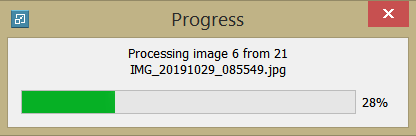

# DownScaler

DownScaler est un outil de redimensionnement et de compression d'images supportant les formats JPEG, JPG, PNG, BMP et TIFF.

## Sélection des images et du dossier de destination

L'explorateur de fichiers/de dossiers s'ouvrira en utilisant un chemin précédemment enregistré. En particulier, à l'ouverture du programme, il s'agira du chemin enregistré lors de la session précédente.

Si le checkbox "Overwrite the existing files" est coché, les images seront écrites par dessus des existantes.
Les changements effectués à ce niveau d'interface mettent systématiquement à jour l'affichage des options disponibles pour la dénomination des fichiers.

## Noms des fichiers de sortie

Les noms peuvent être personnalisés dans le groupBox "Output file names". On peut ajouter un préfixe ou un suffixe au nom d'origine, soit saisir le nom manuellement. Un suffixe incrémental entier sera ajouté à ce dernier si au moins deux fichiers sont sélectionnés.

## Paramètres de redimensionnement et de compression
- La largeur et la hauteur de l'image seront multipliées par un facteur d'échelle choisi divisée par 100 assurant la conservation des proportions de l'image. 
- L'image sera d'autant plus compressée que le paramètre "Image quality" est petit. Attention, la valeur de qualité supérieure à 80 peut sensiblement augmenter la taille du fichier de sortie.

## Resize and save

Les images sont traitées dans une boucle en appliquant les transformations de rotation présentes dans leurs métadonnées respectives pour préserver l'aspect de l'image d'origine. 

Une barre de progression permet de suivre l'état d'avancement de l'opération.

Une fois terminée, un message apparaît. Il notifie du résultat (succès total ou partiel) ainsi que de la différence de taille sur l'espace disque entre les fichiers sources et les fichiers de sortie exprimée en en Mébioctets.

 

En cas de succès partiel, à ce message s'ajoutera le nombre de fichiers traités avec succès ainsi que le nombre et la liste des fichiers qui n'ont pas pu être lus. 

Si aucun fichier n'a pu être lu, le message suivant va apparaître :

Si le dossier de destination contient un fichier portant le même nom (chemin complet) que le fichier de sortie et que la case "Overwrite the existing files" n'est pas cochée, une boîte de dialogue apparaît pour demander à l'utilisateur de choisir l'une des trois actions suivantes à appliquer au fichier de sortie :
- le renommer automatiquement (en ajoutant un nombre approprié);
- l'enregistrer en écrasant le fichier existant;
- l'ignorer (l'image d'origine ne sera pas traitée).

